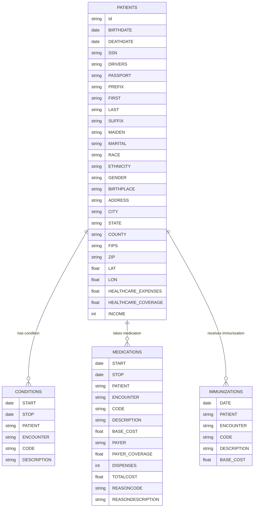

## Tablas en Synthea

| Tabla         | Descripción                                        |
|---------------|----------------------------------------------------|
| Patients     | Contiene información demográfica y médica básica.  |
| Medications    | Registros de medicamentos prescritos.              |
| Conditions  | Enfermedades y condiciones clínicas documentadas.  |

----

## Example person table
### Person Table

| Id                                   | BIRTHDATE   | DEATHDATE   | SSN         | DRIVERS   | PASSPORT   | PREFIX   | FIRST        | LAST         | SUFFIX   | MAIDEN     | MARITAL   | RACE   | ETHNICITY   | GENDER   | BIRTHPLACE                  | ADDRESS           | CITY      | STATE         | COUNTY           |   FIPS |   ZIP |     LAT |      LON |   HEALTHCARE_EXPENSES |   HEALTHCARE_COVERAGE |   INCOME |
|:-------------------------------------|:------------|:------------|:------------|:----------|:-----------|:---------|:-------------|:-------------|:---------|:-----------|:----------|:-------|:------------|:---------|:----------------------------|:------------------|:----------|:--------------|:-----------------|-------:|------:|--------:|---------:|----------------------:|----------------------:|---------:|
| f0bfa360-a7b8-a4ff-1ba4-1dc9952c2e05 | 2014-03-31  |             | 999-57-3081 |           |            |          | Terresa418   | Towne435     |          |            |           | black  | nonhispanic | F        | Lynn  Massachusetts  US     | 410 Ortiz Avenue  | Boston    | Massachusetts | Suffolk County   |  25025 |  2131 | 42.32   | -71.0098 |                1100   |       10890.8         |     8995 |
| 935bad98-c3b4-5756-44be-12bf55adb976 | 1966-05-20  |             | 999-53-4226 | S99919491 | X50357560X | Mrs.     | Evangeline16 | Considine820 |          | Lowe577    | M         | white  | nonhispanic | F        | Boston  Massachusetts  US   | 508 DuBuque View  | Salem     | Massachusetts | Essex County     |  25009 |  1970 | 42.538  | -70.8536 |               15893.8 |           2.16515e+06 |    24217 |
| daa832b2-a84c-6dec-87a0-4f50b97771db | 1982-02-21  |             | 999-54-2980 | S99915673 | X9496139X  | Mrs.     | Bertie593    | Johns824     |          | Simonis280 | M         | white  | nonhispanic | F        | Westford  Massachusetts  US | 302 Dibbert Brook | Millville | Massachusetts | Worcester County |    nan |     0 | 42.0248 | -71.5792 |               55502.5 |      917610           |    58179 |