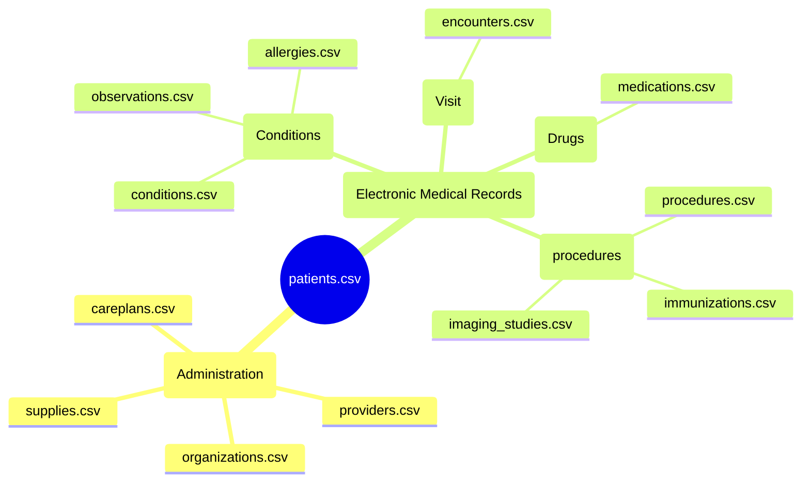

## What is Synthea?

Synthea is a synthetic patient data generator that simulates realistic medical records. It is useful for training machine learning models in the healthcare field.

> Data updated as of `{{database.version_date}}` with version `{{database.version}}`
